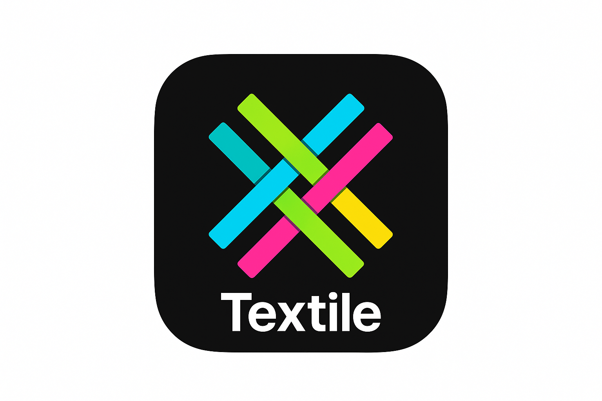

🧶 Textile Platform

  

  <strong>A hyper-scalable, polyglot social platform engineered to surpass modern networks.</strong>

---

📛 Status & Compliance

<!-- Build --><!-- Version --><!-- Proprietary --><!-- Internal Use --><!-- Microservices --><!-- Encrypted --><!-- Infra --><!-- Architecture --><!-- Rust --><!-- Kotlin --><!-- Kafka --><!-- Secure -->

---

🔒 Confidentiality Notice

This software is PROPRIETARY and intended only for internal organizational use.
No source code, architectural diagrams, or documentation may be shared outside the organization.

Violations trigger automatic audit logging + legal escalation.

---

🗺️ Architecture Overview

Textile adopts a Hybrid Polyglot Microservices Architecture, balancing extreme performance with clean business logic separation.

Component	Technology Stack	Purpose

Performance Critical	Rust (Tokio, async)	API Gateway, Media Pipeline, WebSockets, Ultra-fast Caching
Business Logic	Kotlin (JVM)	User, Post, Timeline, Messaging, Moderation, Ads
Data Stores	PostgreSQL, Cassandra, Redis, Elasticsearch	Relational, High-volume DMs, Caching, Vector Search
Infrastructure	Kubernetes, Istio, Terraform, Helm	Workload orchestration, Meshing, IaC
Event Bus	Kafka	Async events, notifications, analytics ingestion
Native Clients	SwiftUI (iOS), Kotlin Compose (Android)	High-fidelity mobile UX

---

🔑 Gating Strategy (Critical Security Feature)

All feature visibility—buttons, actions, entry points—is controlled entirely by backend-computed:

viewer_context

Clients never locally decide permission-based UI.
All UI uses ActionGater components to ensure:

no spoofed states

no unauthorized actions

fully consistent cross-platform behavior

---

✨ Core Feature Set

📱 User Interaction

Profiles, follow system, blocks, verification

CRUD for posts, replies, quotes

Likes, reposts, bookmarks

ML-personalized timelines

Full DMs service with:

Typing indicators

Attachments

Reactions

Delivery receipts

End-to-End Encryption

---

🧠 Intelligence & Performance

Multi-model Recommendations

Vector Semantic Search (Embeddings)

GPU Media Transcoding (Rust pipelines)

Smart Circuit Breakers + Retry Logic

---

🛡️ Security & Ops

JWT, OAuth2, MFA

Authentication via Gateway

Authorization via auth-service

Automated moderation pipeline

Real-time analytics ingestion (Kafka)

Ads targeting + premium monetization

---

💻 Local Development

Prerequisites

Docker / Docker Compose

Kubernetes (Minikube/K3s)

Terraform & Helm

Rust (stable)

JDK 17+ / Gradle

Xcode (iOS) / Android Studio

---

🚀 Setup & Execution

Clone Repo

git clone <internal-repository-url>
cd Textile/backend

Initialize Backend

./scripts/setup.sh
docker-compose up -d
./scripts/seed-data.sh   # optional

Client Setup

Client	Directory	Setup

iOS	../ios/	Open project → pod install
Android	../android/	Import to Android Studio → Sync Gradle

---

✅ Testing

Type	Location	Command	Purpose

Unit	Each service	./scripts/test-all.sh	Validate logic
Integration	backend/tests/integration	./scripts/integration-tests.sh	Cross-service
Client	Mobile IDEs	Native runners	UI + gating verification

---

📄 Documentation

docs/architecture/

docs/api/openapi.yaml

docs/runbooks/

---

🤝 Contribution Rules

Internal developers only

Branch from main

Follow architecture guidelines

PRs require owner approval

---

Last Updated: November 17, 2025
